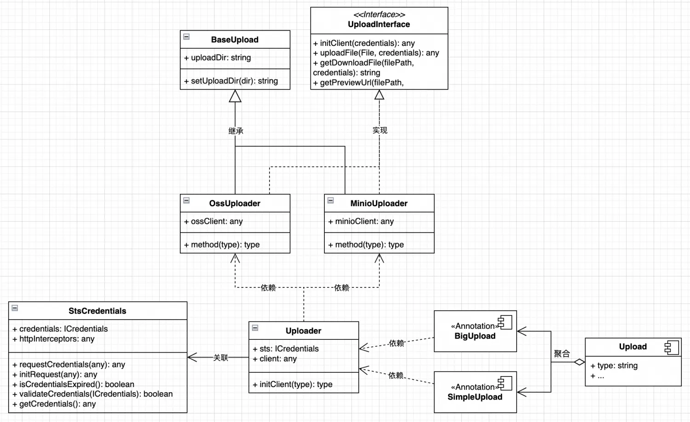

# fe-upload

前端通用文件直传组件，支持大文件分片，兼容 oss/minio，并包括 UI 组件。



## Usage

```sh
npm i fe-upload -S
```

## 参考

[oss sts 直传](https://www.alibabacloud.com/help/zh/oss/use-cases/uploading-objects-to-oss-directly-from-clients/)

## LICENSE

MIT
