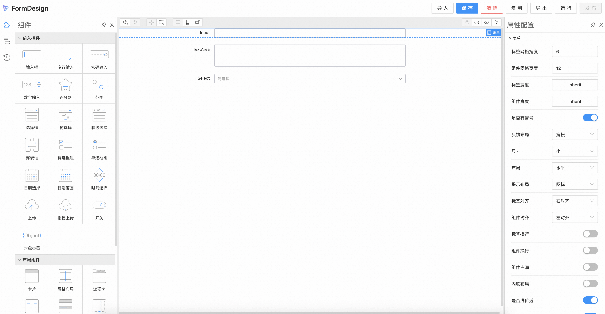

# form-design-next

基于 Formily Next 的表单设计器

[](https://npmjs.org/package/form-demo)
[](https://npmjs.org/package/form-demo)

A react library developed with dumi



DEMO 访问：https://unpkg.com/form-design-next/docs-dist/index.html

## 本地开发

```sh
yarn install
yarn workspace form-render-next2 run build
yarn workspace form-design-next run start
```

本地访问：http://127.0.0.1:8000/#/

## LICENSE

MIT
